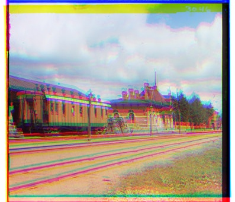

# 🎨 Image Reconstruction with OpenCV

A Python-based project to process grayscale images, divide them into sections, and reconstruct them into visually compelling composites using OpenCV.

---


## 🖼️ Visual Overview

### Input Image


### Reconstructed Image


---


## ✨ Features
- Processes grayscale images into unique composites.
- Demonstrates core OpenCV techniques: splitting, merging, and saving images.
- Outputs reconstructed images ready for visualization.

---

## 📋 Quick Start

1. **Clone the Repository**:
   ```bash
   git clone https://github.com/sonaykaraaslan/grayscale-to-rgb.git
   cd your_repository_name
